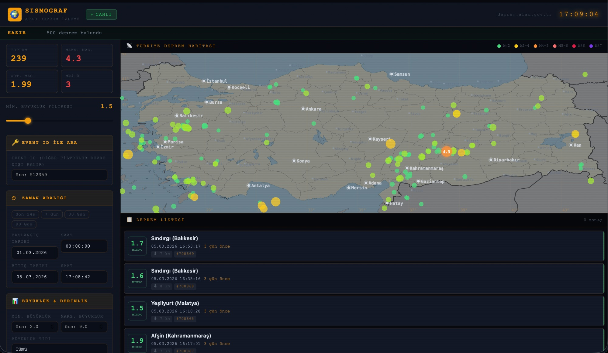

# 🌍 Sismograf — AFAD Deprem Takip Sistemi

Türkiye genelindeki depremleri gerçek zamanlı olarak izleyen, **saf HTML / CSS / Vanilla JS** ile geliştirilmiş web uygulaması. Veri kaynağı olarak AFAD'ın resmi API'si kullanılmaktadır.



---

## ✨ Özellikler

- 🗺️ **Gerçek Türkiye Haritası** — Wikimedia Commons'tan alınan equirectangular harita üzerine, AFAD koordinatlarıyla birebir eşleşen deprem noktaları
- 📡 **Canlı AFAD Verisi** — `servisnet.afad.gov.tr` üzerinden gerçek zamanlı deprem sorgusu
- 🔍 **Gelişmiş Filtreleme** — Tarih aralığı, büyüklük, derinlik, dikdörtgen & radyal konum sınırları, Event ID
- 📊 **Anlık İstatistikler** — Toplam, maksimum/ortalama büyüklük, M≥4.0 sayacı
- 🎚️ **Canlı Büyüklük Slider** — API'ye gitmeden istemci tarafında anlık filtreleme
- 🏙️ **81 İl İşaretlendi** — Büyük şehirler halka + kalın yazıyla vurgulanmış
- ⬇️ **CSV Dışa Aktarma** — Tüm sonuçları UTF-8 BOM'lu CSV olarak indirme
- 💾 **5 Dakikalık Cache** — Aynı sorgu tekrar atılmaz; sayfa yenilenince anında yüklenir
- 📱 **Tam Responsive** — Mobil, tablet ve masaüstü uyumlu

---

## 🚀 Kurulum

### Gereksinimler
- PHP destekli web hosting **veya** yerel PHP sunucusu

### Dosyaları Hosting'e Yükleyin

```
/
├── index.html
├── app.js
├── map.js
├── utils.js
├── style.css
└── api.php          ← CORS proxy (PHP)
```

> Tüm dosyalar aynı klasörde olmalıdır.

### Yerel Test

```bash
# PHP yerleşik sunucusuyla
php -S localhost:8080

# Ardından tarayıcıda
open http://localhost:8080
```

---

## 🔧 Mimari

```
Tarayıcı  →  api.php?start=...&end=...&format=json
                ↓  (aynı origin — CORS sorunu yok)
           servisnet.afad.gov.tr/apigateway/deprem/apiv2/event/filter
                ↓
           JSON yanıt  →  Harita + Liste render
```

**Neden `api.php`?**  
AFAD'ın `servisnet.afad.gov.tr` adresi `Access-Control-Allow-Origin` başlığı döndürmez. Tarayıcılar cross-origin istekleri engeller. `api.php` sunucu tarafında proxy görevi görerek bu kısıtlamayı aşar.

---

## 📋 API Parametreleri

Uygulama AFAD Deprem Web Servisi v2'yi kullanır:

| Parametre | Açıklama | Örnek |
|-----------|----------|-------|
| `start` | Başlangıç zamanı | `2024-01-01T00:00:00` |
| `end` | Bitiş zamanı | `2024-12-31T23:59:59` |
| `minmag` | Minimum büyüklük | `4.0` |
| `maxmag` | Maksimum büyüklük | `9.0` |
| `magtype` | Büyüklük tipi | `ML`, `Mw`, `mb` |
| `mindepth` | Minimum derinlik (km) | `0` |
| `maxdepth` | Maksimum derinlik (km) | `700` |
| `minlat/maxlat` | Enlem sınırları (dikdörtgen) | `36.0` / `42.5` |
| `minlon/maxlon` | Boylam sınırları (dikdörtgen) | `26.0` / `45.0` |
| `lat/lon/maxrad` | Radyal sınır | — |
| `limit` | Sonuç limiti (maks. 25.000) | `500` |
| `orderby` | Sıralama | `timedesc`, `magnitudedesc` |
| `eventid` | Tekil deprem sorgusu | `512359` |

> ⚠️ **Uzun tarih aralıklarında:** `limit=500` + `orderby=timedesc` yalnızca en yeni 500 depremi getirir. Geçmiş büyük depremleri bulmak için `orderby=magnitudedesc` + yüksek limit kullanın.

---

## 🗂️ Dosya Yapısı

| Dosya | Görev |
|-------|-------|
| `index.html` | UI iskeleti — header, sidebar, harita, liste |
| `style.css` | Sismik kontrol odası teması (dark, amber vurgu) |
| `app.js` | API iletişimi, state yönetimi, render, CSV export |
| `map.js` | Wikimedia SVG haritası, koordinat dönüşümü, tooltip |
| `utils.js` | Cache, debounce, validasyon, URL builder |
| `api.php` | CORS proxy — AFAD API'sine sunucu taraflı istek |

---

## 🎨 Teknoloji

- **Sıfır bağımlılık** — React, Vue, jQuery, Leaflet yok
- **ES Modules** — `import/export` ile modüler yapı
- **SVG** — Deprem noktaları ve harita katmanı tamamen SVG
- **CSS Grid + Flexbox** — Responsive layout
- **localStorage** — 5 dakikalık sorgu cache'i

---

## 📍 Harita Koordinat Sistemi

Wikimedia Turkey location map (equirectangular projeksiyon) kullanılmaktadır:

```
West : 25.668°E    East : 44.834°E
North: 42.107°N    South: 35.817°N
```

`geoToSvg(lat, lon)` fonksiyonu doğrusal dönüşümle AFAD koordinatlarını piksel konumuna çevirir:

```js
x = ((lon - 25.668) / (44.834 - 25.668)) * 900
y = ((42.107 - lat) / (42.107 - 35.817)) * 295
```

---

## 📄 Lisans & Kaynak

- Deprem verileri: [AFAD Deprem Dairesi](https://deprem.afad.gov.tr) © T.C. İçişleri Bakanlığı
- Harita görseli: [Wikimedia Commons](https://commons.wikimedia.org/wiki/File:Turkey_location_map.svg) — Eric Gaba, CC BY-SA
